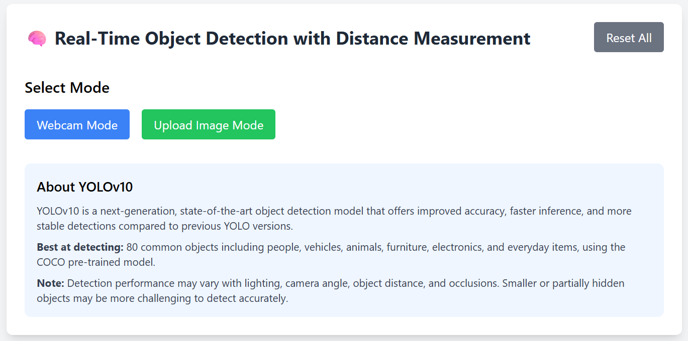
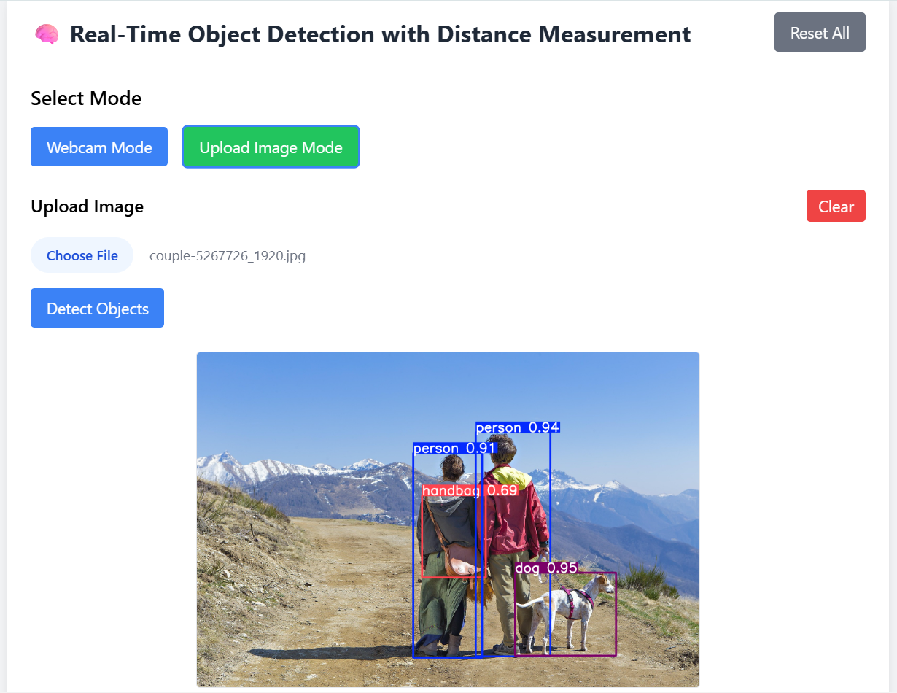
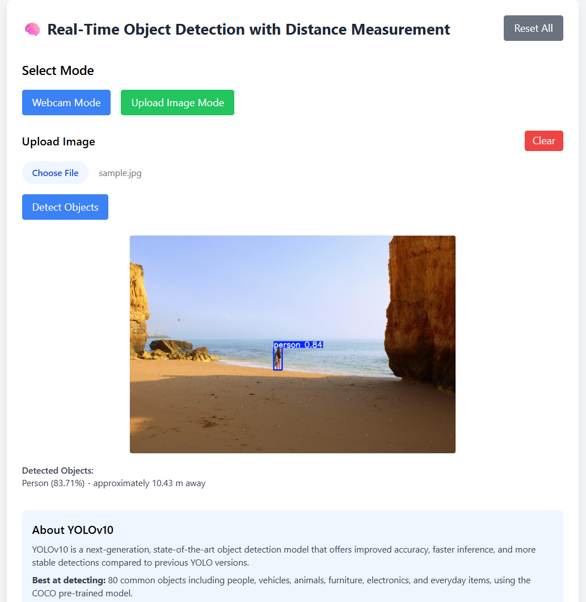
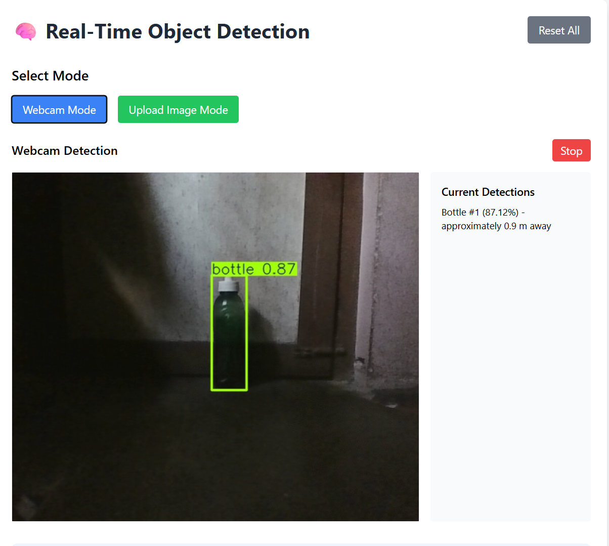

<div align=center>
<a name="top"></a>

# 🧠 Real-Time Object Detection using YOLOv10, Deep SORT, and OpenCV

[](https://www.python.org/)
[](https://flask.palletsprojects.com/)
[](https://github.com/ultralytics/ultralytics)
[](https://github.com/levan92/deep_sort_realtime)
[](LICENSE)

</div>

## 🎯 Overview

A modern, responsive web application for real-time object detection and tracking using **YOLOv10**, **Deep SORT**, and **OpenCV**. Detect objects from your webcam or uploaded images, track them in real-time, and enjoy a clean, user-friendly interface built with **Flask** and **Tailwind CSS**.






## 📁 Project Structure

```
realtime-object-detection-with-distance/
├── 📄 app.py                 # Main Flask web application with object detection, tracking, and distance estimation
├── 📄 main.py                # Console script for basic object detection from webcam
├── 📄 requirements.txt       # Python dependencies
├── 📄 yolov10s.pt            # YOLOv10 small model weights (pre-trained on COCO dataset)
├── 📁 templates/             # HTML templates for Flask web interface
│   └── 📄 index.html         # Web interface with webcam and upload modes
├── 📁 assets/                # Project assets (contains image files)
└── 📄 README.md              # Project documentation

```

## 🚀 Features

- **Real-time Webcam Detection**: Live object detection from your webcam with bounding boxes and labels
- **Image Upload Detection**: Upload images to detect objects with instant results
- **Distance Estimation**: Approximate distance calculation using monocular camera model
- **Object Tracking**: Robust multi-object tracking using DeepSORT for consistent ID assignment across frames in webcam mode
- **Voice Feedback**: Text-to-speech announcements of detected objects with IDs and distances (Web Speech API for uploads, pyttsx3 for webcam)
- **Stable Detection**: Webcam detections announced only after object stability for 5 seconds
- **Modern UI**: Responsive design with Tailwind CSS, active states, and smooth interactions
- **Error Handling**: User-friendly error messages displayed inline
- **Reset Functionality**: Easy reset to start fresh
- **YOLOv10 Powered**: State-of-the-art object detection model

## 📦 Installation

### Prerequisites

- Python 3.1 or higher
- Webcam (for real-time detection)

### Setup

1. Clone the repository:

   ```bash
   git clone https://github.com/ar-jun-fs9/realtime-object-detection-with-distance.git
   cd realtime-object-detection-with-distance
   ```

2. Create a virtual environment (optional but recommended):

   ```bash
   python -m venv venv
   source venv/bin/activate  # On Windows: venv\Scripts\activate
   ```

3. Install dependencies:
   ```bash
   pip install -r requirements.txt
   ```

## 🏃 Usage

### Web Application (Recommended)

Run the full web application with modern UI:

```bash
python app.py
```

Open `http://localhost:5000` in your browser and choose between Webcam Mode or Upload Image Mode.

### Console Scripts

- **Basic Detection**: `python main.py` - Detects objects from webcam and prints to console

**Note:** Console scripts require exclusive access to the webcam. Ensure the web application is not running simultaneously, as it may prevent the scripts from accessing the camera.

## 🛠️ Tech Stack

- **Backend**: Flask (Python web framework)
- **AI/ML**: YOLOv10 (Ultralytics), DeepSORT (tracking), OpenCV
- **Frontend**: HTML, Tailwind CSS, JavaScript
- **Model**: yolov10s.pt (pre-trained COCO dataset)

## 📏 Distance Measurement

**Note:** Distance measurements are approximate and based on assumed real-world object heights using a monocular camera model. Accuracy varies with camera angle, object orientation, lighting, and focal length calibration. Results provide nearly accurate estimates but should not be used for precise measurements.

The application includes distance estimation using a monocular camera approach with the pinhole camera model. Distances are calculated based on known real-world object sizes and bounding box dimensions using the formula:

```
Distance = (Real Object Height × Focal Length) / Object Height in Image
```

**Focal Length Calibration**: For accurate measurements, calibrate your webcam's focal length:

1. Place an object of known height (H) at a known distance (D) from the camera.
2. Capture an image and measure the object height in pixels (h) from the bounding box.
3. Compute focal length: `f = (h × D) / H`
4. Update the `FOCAL_LENGTH` value in `app.py` with your calibrated value.

**Supported Objects**: The system has predefined heights for common COCO dataset objects (person: 1.7m, car: 1.5m, etc.).

**Accuracy Tips**:

- Ensure the entire object fits in the bounding box (top to bottom).
- Keep the object perpendicular to the camera to avoid perspective shrinkage.
- Use good lighting to prevent YOLO from detecting smaller boxes.
- Ensure objects are facing the camera directly.
- Calibrate focal length for your specific webcam for best results.

## 🎯 Object Tracking with IDs (Webcam Mode)

In Webcam Mode, each detected object is assigned a unique ID using DeepSORT for robust multi-object tracking. This allows consistent tracking of objects across frames in real time, preventing ID resets when objects move. The tracking works seamlessly with distance estimation and voice feedback.

**Key Features:**

- **Unique ID Assignment**: Every object in the webcam feed receives a persistent ID (e.g., Bottle #1, Person #2).
- **Real-Time Distance Reporting**: The system announces the approximate distance of each object from the camera using the pinhole camera model.
- **Continuous Updates**: As objects move or change distance, the ID remains consistent, and updated distances are announced.
- **Audio Feedback Integration**: Voice announcements are synchronized with stable detections to avoid repeated or false announcements.

**Benefits:**

- Track objects consistently without confusing new detections with old ones.
- Supports object counting, analytics, and monitoring in dynamic environments.
- Improves user experience with accurate distance info and audio alerts.

**Example Usage:**

Open Webcam Mode. The app detects objects in real-time and displays them with unique IDs in the sidebar. The system announces objects with their IDs and distances, for example:

- Bottle #1 is 1.2 meters away
- Person #2 is 2.5 meters away

When objects move, their IDs stay the same, and distance updates continue dynamically.

**Note**: This tracking feature is Webcam Mode only. Uploaded images are single frames, so unique IDs are not applied there.

## 🎤 Voice Feedback

The application includes text-to-speech functionality to announce detected objects verbally:

- **Upload Mode**: Speaks detections immediately after processing the image.
- **Webcam Mode**: Announces detections every 5 seconds if objects are consistently detected, providing audio feedback for accessibility.

## 🔄 Stable Detection

For webcam mode, voice announcements are triggered only when objects remain stable in the frame for at least 5 seconds, reducing false positives and improving user experience.

## 🚀 Future Enhancements

- **Advanced Analytics**: Build upon DeepSORT tracking to add analytics features including:
  - Object speed estimation based on movement across frames
  - Movement pattern analysis and trajectory prediction
  - Object density statistics for crowd monitoring
  - Optional alerts for specific conditions (e.g., too many people detected, social distancing violations)
- **Advanced Calibration**: Automatic focal length calibration using reference objects.

## 📊 YOLOv10 Information

YOLOv10 excels at detecting:

- People, animals, vehicles
- Household objects, furniture
- Food items, appliances
- Sports equipment, tools

**Note**: Detection accuracy may vary with lighting, angles, and object size. Best results with clear, well-lit images/videos.

## 📄 License

[](#)

<div align="center">
   
  **[⬆ Back to Top](#top)**
  
</div>